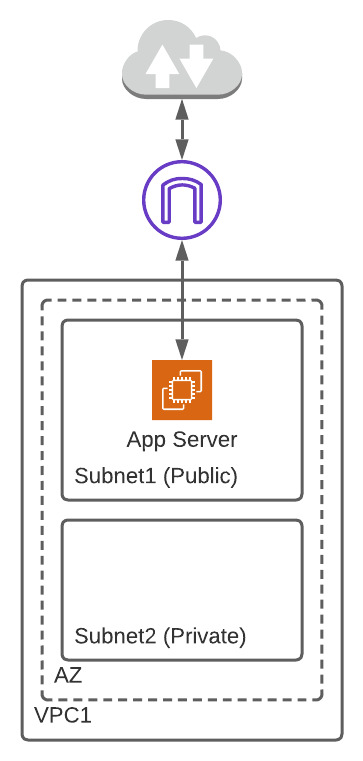
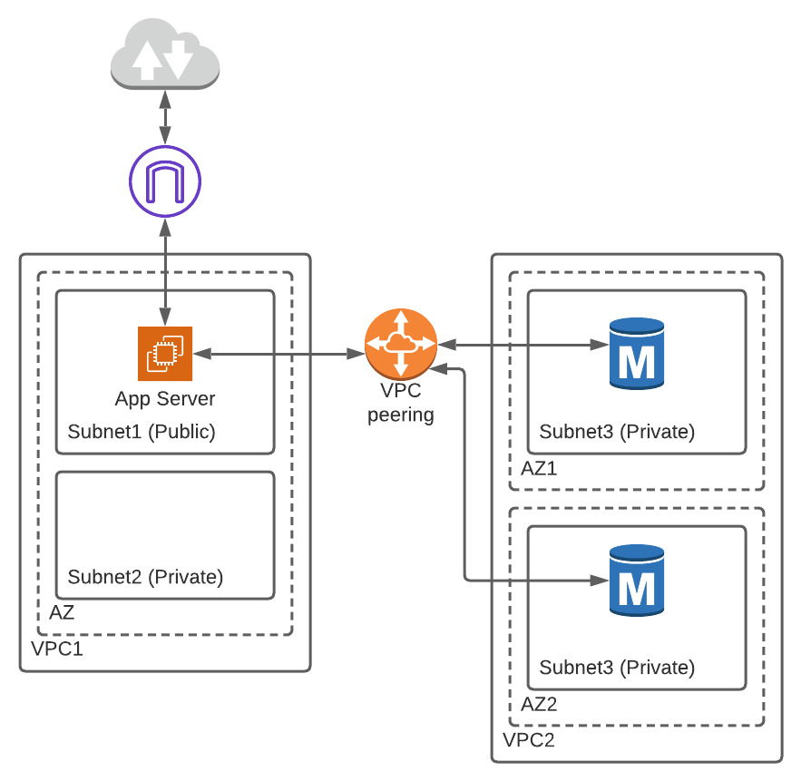

# Lab3 - Simple App, Multiple VPC, VPC Peering

Creating 2 VPCs in AWS, and connect them using VPC peering Connection

## Components

### Background Information

* VPC peering technique is mostly used between different accounts and regions in AWS and involve layers of security. In order to mimic the technique simply and effectively the source code reflects usage of 2 AWS `provider` calls. Each `provider` is focused on a different region and each component used in the source code also required to be assigned with the `provider` in order to separate these environments.

### VPC1

A fully working stand-alone architecture including a public subnet with a web application and a private subnet.
The web application is static in this case, missing connection to the DB (Which can be easily established if DB will be created inside VPC1).

### VPC2

A fully working stand-alone architecture including 2 private subnets located in different AZ and running a RDS DB.

### VPC Peering connection

Connecting between VPC1 and VPC2 allowing access to the DB. VPC peering is usually used when a connection to a separate organization is needed - a handshake need to be performed in order for the peering to work correctly. Once peering is establish access is given to VPC1 to use resources from VPC2

### Testings

A tool that proved itself very helpful during the process of building this architecture is `Reachability Analyzer` tool. This tool can show the location of network failures inside the architecture giving the developer an area to focus on.